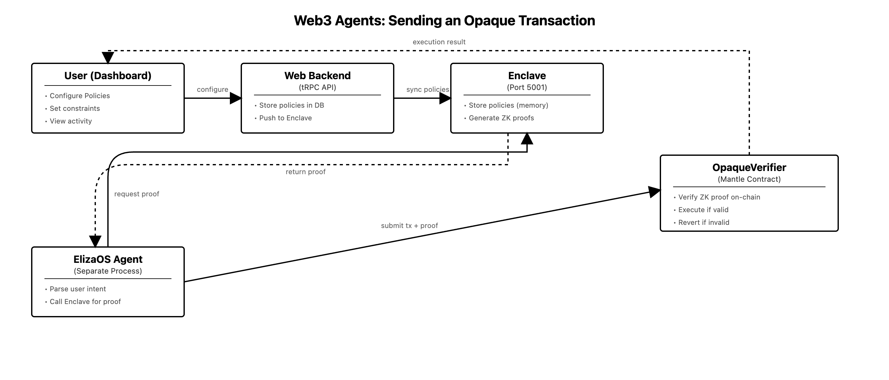
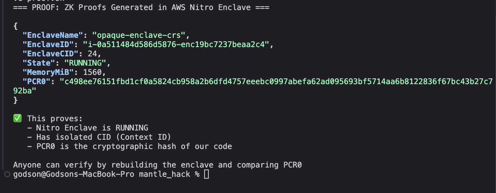

# Opaque

**Trust-minimized automation for Web3 agents** — ZK policy enforcement that allows agents to execute on-chain actions without knowing or manipulating the rules that govern them.



## Table of Contents

- [Overview](#overview)
- [Demo](#demo)
- [Integration Points](#integration-points)
- [Demo Configuration](#demo-configuration)
- [Local Testing](#local-testing)
- [Self-Hosted Enclave](#self-hosted-enclave)
- [Resources](#resources)
- [Team](#team)
- [Compliance](#compliance)

## Overview

Opaque separates **policy evaluation** from **agent execution**. Agents propose transactions, but policies are evaluated inside an Enclave using zero-knowledge proofs. The agent never sees the rules — it only learns whether an action is allowed.

This makes context manipulation attacks (prompt injection, memory poisoning) irrelevant.



## Demo

🎬 **[Watch Demo Video](https://vimeo.com/1154584994)** (4 min)

📊 **[View Pitch Deck](https://opaque-web-nine.vercel.app/pitch.html)**

🌐 **[Live App](https://opaque-web.vercel.app)**

## Integration Points

| Component | Description | Link |
|-----------|-------------|------|
| Web Dashboard | Configure policies, install adapters | [web/](./web) |
| Enclave | ZK proof generation (Noir + Barretenberg) | [packages/enclave/](./packages/enclave) |
| ElizaOS Plugin | Agent integration for proof requests | [packages/plugin-opaque/](./packages/plugin-opaque) |
| Smart Contracts | Circuits & On-chain verifier (Mantle Sepolia) | [mantle_hardhat/](./mantle_hardhat) |
| API Reference | Enclave endpoints | [Playground](https://opaque-web-nine.vercel.app/playground) |

## Demo Configuration

| Item | Value |
|------|-------|
| Network | Mantle Sepolia |
| Verifier Contract | `0x07D60F1Cf13b4b1E32AA4eB97352CC1037286361` |
| Token (MCK) | `0xb9e8f815ADC8418DD28f35A7D147c98f725fa538` |
| Enclave Endpoint | `http://35.159.224.254:8001` |
| PCR0 | `c498ee76151fbd1cf0a5824cb958a2b6dfd4757eeebc0997abefa62ad095693bf5714aa6b8122836f67bc43b27c792ba` |

## Local Testing

### 1. Install an Adapter (Web)

Visit [opaque-web-nine.vercel.app](https://opaque-web-nine.vercel.app), connect wallet, and install a Mantle Transfer adapter with your own policy configuration.

### 2. Run ElizaOS Agent

```bash
cd elizaos-agent
cp .env.example .env  # Configure your keys
bun install
bun run start
```

See [ElizaOS docs](https://docs.elizaos.ai) for detailed agent setup.

### 3. Test via Playground

Use the Opaque [Playground](https://opaque-web.vercel.app-nine/playground) to test policy storage and proof generation.

## Self-Hosted Enclave

### Pull Docker Image

```bash
docker pull ghcr.io/acgodson/opaque/opaque-enclave:latest
```

### Build Nitro Enclave (requires AWS Nitro instance)

```bash
nitro-cli build-enclave \
  --docker-uri ghcr.io/acgodson/opaque/opaque-enclave:latest \
  --output-file opaque.eif

nitro-cli run-enclave \
  --eif-path opaque.eif \
  --memory 1560 \
  --cpu-count 2
```

### API Endpoints

Replace `{HOST}` with your instance public IP:

```bash
# Health check
curl -X POST http://{HOST}:8001 \
  -H "Content-Type: application/json" \
  -d '{"type":"HEALTH_CHECK"}'

# Store policy
curl -X POST http://{HOST}:8001 \
  -H "Content-Type: application/json" \
  -d '{
    "type": "STORE_POLICY_CONFIG",
    "userAddress": "0x...",
    "installationId": 1,
    "policyConfig": {
      "maxAmount": {"enabled": true, "limit": "100000000000000000000"},
      "timeWindow": {"enabled": false, "startHour": 0, "endHour": 23},
      "whitelist": {"enabled": false, "root": "0", "path": ["0","0"], "index": 0}
    }
  }'

# Generate proof
curl -X POST http://{HOST}:8001 \
  -H "Content-Type: application/json" \
  -d '{
    "type": "GENERATE_PROOF",
    "userAddress": "0x...",
    "installationId": 1,
    "txData": {
      "amount": "50000000000000000000",
      "recipient": "0x...",
      "timestamp": 1737043200,
      "userAddress": "0x..."
    }
  }'
```

See [ATTESTATION.md](./ATTESTATION.md) for verification details.

## Resources

| Resource | Link |
|----------|------|
| Demo Video | [vimeo.com/1154584994](https://vimeo.com/1154584994) |
| Pitch Deck | [pitch.html](https://opaque-web-nine.vercel.app/pitch.html) |
| ElizaOS Plugin | [@tinybirdpro/plugin-opaque](https://www.npmjs.com/package/@tinybirdpro/plugin-opaque) |
| Attestation Docs | [ATTESTATION.md](./ATTESTATION.md) |
| Noir Circuit | [mantle_hardhat/noir/](./mantle_hardhat/noir) |

## Team

**Solo build by [@acgodson](https://twitter.com/Ac_godson)**

## Compliance

This project does not involve regulated assets. The demo uses test tokens (MCK) on Mantle Sepolia testnet. No real financial instruments are traded or managed.

---

Built for **Mantle Global Hackathon 2025** with Noir + Mantle
